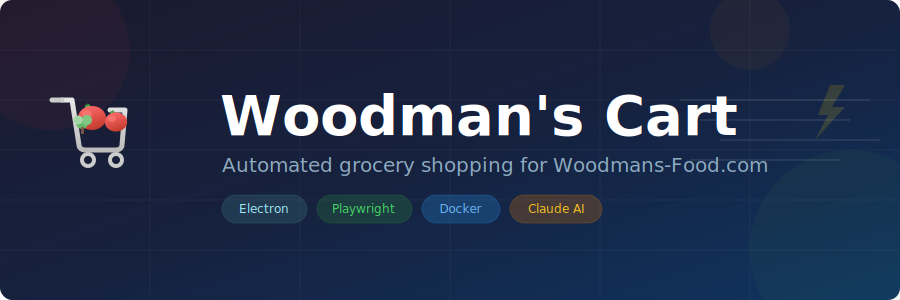

<p align="center">
  
</p>

# Woodman's Cart

Automate your grocery shopping on [ShopWoodmans.com](https://www.shopwoodmans.com). Manage weekly staples, build recipes, generate meal ideas with AI, and add everything to your online cart with one click.

Runs as an **Electron desktop app** or a **standalone web server** (for Docker/Unraid).

## Features

- **Staple Items** &mdash; Maintain a list of weekly essentials that get added to your cart every time
- **Recipe Management** &mdash; Create recipes with ingredients, enable/disable them per week
- **AI Recipe Generation** &mdash; Generate recipes with Claude AI based on a prompt, dietary needs, or what's in your pantry
- **Product Search** &mdash; Search the Woodman's catalog and link exact products to your items
- **One-Click Cart** &mdash; Adds all enabled items to your ShopWoodmans.com cart automatically
- **Two Automation Modes**
  - *Standard* &mdash; Full Playwright browser automation (~3-5s per item)
  - *Fast* &mdash; Direct GraphQL API calls (~10x faster)
- **Dark Mode** &mdash; Because of course
- **Mobile-Friendly** &mdash; Works as a home screen web app on iOS/Android when running in server mode

## Quick Start

### Desktop (Electron)

```bash
npm install
npm run setup       # downloads Chromium for Playwright
npm start
```

### Docker

```bash
docker build -t woodmans-cart .
docker run -d \
  -p 3456:3456 \
  -e WOODMANS_USERNAME=you@email.com \
  -e WOODMANS_PASSWORD=yourpassword \
  -v woodmans-data:/app/data \
  woodmans-cart
```

Then open `http://localhost:3456` in your browser.

### Environment Variables (Docker)

| Variable | Description |
|----------|-------------|
| `WOODMANS_USERNAME` | ShopWoodmans.com login email |
| `WOODMANS_PASSWORD` | ShopWoodmans.com password |
| `ANTHROPIC_API_KEY` | Claude API key (optional, for AI recipe generation) |

## How It Works

1. **Configure** your Woodman's credentials in Settings
2. **Add staples** &mdash; your recurring weekly items
3. **Create or generate recipes** &mdash; toggle them on/off each week
4. **Hit "Add to Cart"** &mdash; the app logs into ShopWoodmans.com and adds everything automatically

In **Standard mode**, Playwright drives a real browser through the checkout flow. In **Fast mode**, it logs in once to grab session cookies, then fires GraphQL API calls directly &mdash; much faster but dependent on Instacart's API stability.

## Architecture

```
Electron (main.js)  ─┐
                      ├─► server.js (Express + WebSocket, port 3456)
Docker (server-standalone.js) ─┘
                                    │
                         ┌──────────┴──────────┐
                    cart-worker.js        cart-worker-fast.js
                   (Playwright browser)    (GraphQL API)
                         └──────────┬──────────┘
                                    │
                            ShopWoodmans.com
```

The renderer is a vanilla HTML/CSS/JS SPA with no build step. An [API adapter](renderer/api-adapter.js) transparently routes calls through Electron IPC or REST+WebSocket depending on the environment.

## Tech Stack

- **Electron** &mdash; Desktop shell
- **Express + WebSocket** &mdash; Server and real-time updates
- **Playwright** &mdash; Browser automation
- **Claude API** &mdash; AI recipe generation
- **Vanilla JS** &mdash; No framework, no build step

## License

MIT
